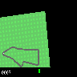

# Model vs Model-Free RL

### Demos

#### DQN

CarRacing-v0            |  VizdoomDefendCenter-v0
:-------------------------:|:-------------------------:
  |  

#### World Models
Real Rollout | Hallucinated Rollout
:-------------------------:|:-------------------------:
 | 


### Training World Models

#### Training VAE
  * Source set_pythonpath.bash
  * Go into the dataset/car_racing directory and run rollout_wrapper.py
  * Run make_csv.py in datasets/car_racing
  * Call train_vae.py
  * Sampled mappings of noise reconstructions are seen in results

Increase the number of rollouts in rollout.bash and rollout.py to generate more data. This currently
trains on the random action policy, so there isn't much variation in the road.

#### Training MDRNN
* Train VAE as above (duh!)
* Call train_mdrnn.py

#### Training Controller
  * Train the VAE and MDRNN
  * Call python train_controller.py --n-samples 4 --pop-size 6 --target-return 950 --max-workers=12
    * max-workers sets how many population parameters to run in parallel, where each population
      requires a core for evaluation

Note that training the MDRNN requires that the VAE is well trained, and training the controller
requires that both the VAE and MDRNN are well trained!

### Training DQN

```
xvfb-run -a -s "-screen 0 1400x900x24 +extension RANDR" python3 train_dqn.py --task "CarRacing-v0"
```

Note that `xvfb-run` is necessary iff you are training on computer without a display connected (e.g. over SSH).
